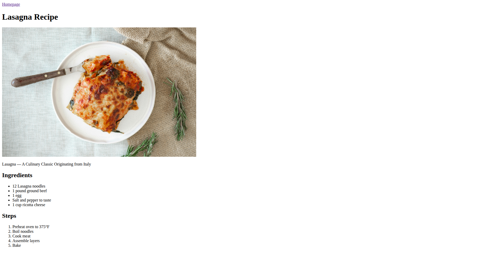

# Odin Recipes

This is a solution to the [Recipes assignment](https://www.theodinproject.com/lessons/foundations-recipes) from The Odin Project.

**[View Live Demo](https://hasanhozgur.github.io/odin_recipes/)**

## The Challenge
The goal was to build a basic website using only HTML to demonstrate understanding of:
* HTML Boilerplate
* Ordered and Unordered Lists
* Images and Links (Absolute vs Relative paths)
* Directory structure

## Screenshot

## Technologies Used
* HTML
